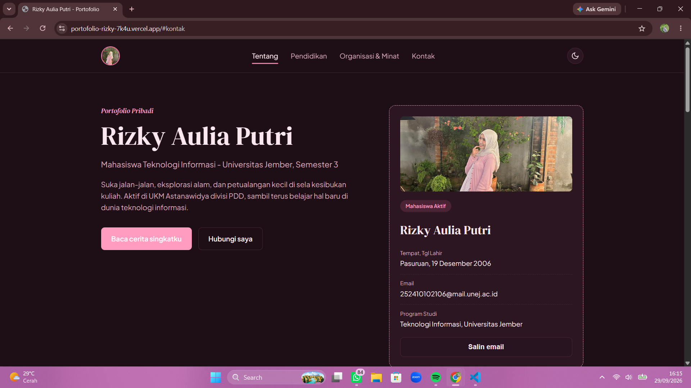
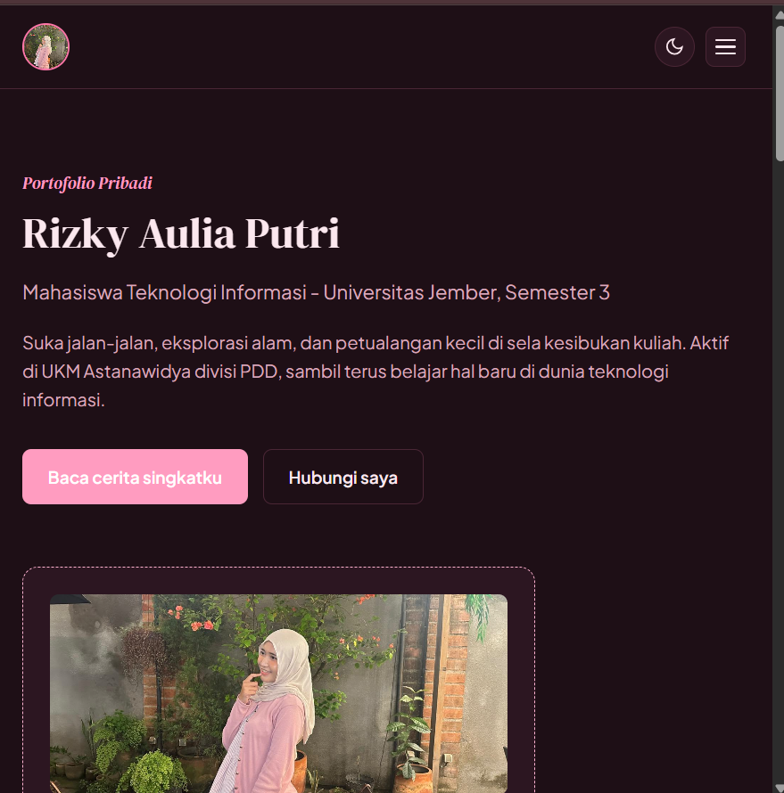
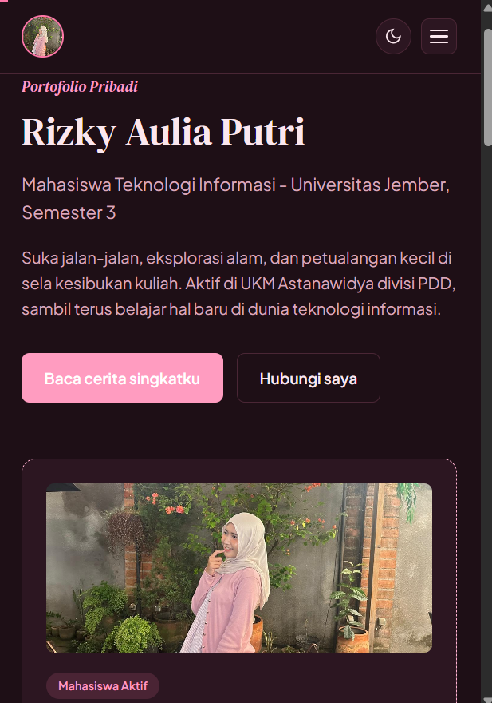

# Portofolio Pribadi - Rizky Aulia Putri

Website portofolio pribadi, dibangun dengan **HTML, CSS murni (tanpa Tailwind/Bootstrap), dan JavaScript (DOM)**. Responsif untuk mobile, tablet, dan desktop.

> Live demo: https://portofolio-2106.vercel.app/

## Screenshot

## Tentang Proyek

Website ini menampilkan profil, cerita singkat, riwayat pendidikan, serta organisasi dan minat milik Rizky Aulia Putri - mahasiswa Program Studi Teknologi Informasi, Fakultas Ilmu Komputer (Fasilkom), Universitas Jember, Semester 3. Konsep visualnya bergaya "kartu pos" (postcard) dengan palet warna pink, merepresentasikan sisi petualang dan suka eksplorasi alam.

## Fitur

| Fitur | Deskripsi |
|---|---|
| Responsive layout | Grid & flexbox murni, breakpoint di 900px / 760px / 480px, navigasi berubah jadi hamburger menu di mobile |
| Dark / Light mode | Toggle tema tersimpan di localStorage, otomatis mengikuti preferensi sistem saat pertama buka |
| Tab Organisasi & Hobi | Beralih antara info organisasi dan hobi tanpa reload halaman |
| Umur otomatis | Dihitung otomatis dari tanggal lahir memakai Date() JavaScript |
| Scroll progress bar & active nav | Progress bar di atas halaman + menu navigasi otomatis menyorot section aktif via IntersectionObserver |
| Salin email | Tombol copy-to-clipboard dengan navigator.clipboard + fallback |
| Validasi form kontak | Validasi nama, email, dan pesan langsung di client, tanpa reload |
| Back to top | Tombol kembali ke atas halaman |

## Struktur Folder